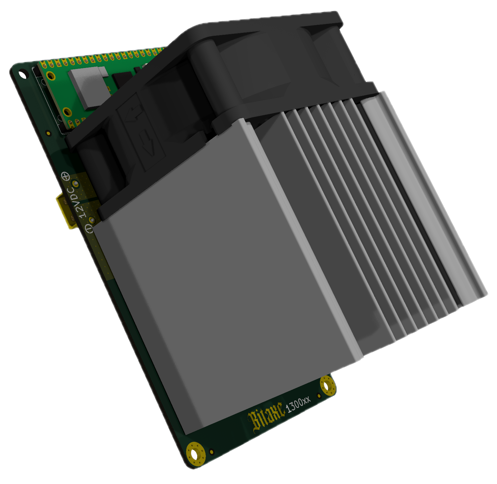

Bitaxe Intel Reference Design System (BIRDS) quad Intel BZM2 ASIC miner for BZM2 firmware development.

It is still an untested prototype! Don't build this expecting it to work out of the box. Do build it if you want to hack on some rad stuff.

- Open Hardware License; Real Open Source.
	- [KiCAD](https://kicad.org) design files. 
- Four Intel BZM2 ASICs, powered in series.
	- Each BZM2 is [nominally](doc/specs.md) 0.7V with approx 350 GH/s @ 1.15 GHz hash frequency.
	- On chip digital temperature and voltage sensors
	- ntime rolling
	- decent cross-domain level shifting, that _hopefully_ works. 
- 11-13V XT30 input voltage
- TPS546D24S single-phase voltage regulator tuned for 2.8V output @ 20A
	- The voltage regulator backside power plane is exposed to hopefully thermally bond it with the main heatsink. 
- New fan control strategy (no more EMC2101)
- Controlled by the [RaspberryPi Pico 2W](https://www.raspberrypi.com/products/raspberry-pi-pico-2/) featuring the RP2350 microcontroller and a Infineon CYW43439 WiFi SoC
	- Rumored to have good embedded Rust support
	- Programmable IO controller for integrating with the gnarly 5Mbaud, 9bit serial on the BZM2
    - Preliminary support with the [bitaxe-raw-pico](https://github.com/bitaxeorg/bitaxe-raw/tree/pico) firmware.
    	- Note: this targets the RP2040 in the Pico. It's pin compatible with with RP2350-based Pico 2. 
- Gerbers _not_ provided to discourage side hacks and AliEx slop. HMU if you need help generating gerbers with KiCad.

